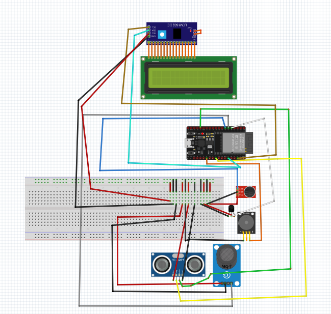

Hi! This is my first time making a project like this so bear with me. I will get right to the chase to not waste your time! 

## Notes:

1. This is for Linux users only.
2. This project can be easily modded
3. COMPATIBLITY AT THE END

## Why this project?

This project is for measuring sensitivity for people who struggle with SPD (Sensory Processing Disorder). SPD is a symptom of autism and many other neurodivergent illnesses. So if you struggle with SPD and want to also make something, this repo is for you.

## Features/what it will do:
1. Collects data from gas, tempearature, sound and ultrasonic sensors.
2. It then displays the results on a web through a local python file in your computer (`Shield.py`)
3. Then it will display this result on a LCD screen and a buzzer
4. It usses RTOS to ensure workload is distributed

## What you need:

1.  ESP32
2. Gas sensor (MQ 7 or 4)
3. Temp sensor (The default code is asuming you are using TMP36 but if you are using some other kind of part number like LM35, i will tell you what to do)
4. Sound sensor (I/O or analog works)
5. Ultrasonic sensor (Assuming you are using HC-SR04)


## How to make the project

### Code
Open the file `SafeSense.ino` then select your board. install the library `hd44780.h`. If you have a different Temp sensor, from line 72-74, replace it with the method your temperature sensor uses to find temperature- do the same for the ultra sonic sensor, just replace lines 93 to 101. Put your ssid (basically your wifi name) on line 32, and password of your wifi lon line 33. 
If you are using a analog sound sensor, change line 90, with the method your sound sensor uses to calculate sound, and Change 91 to ANA
But if you are using a sound sensor which only gives ouout for largesound (no number, 0 or 1), then change line 91 to IO


Open `Main.py`. on line 14 and 31, enter the Path of index.html.

Open `SafeSense.desktop` Change:
1. Line 3 to FULL PATH OF SafeSense.sh
2. Line 4 to FULL PATH OF SafeSense folder
3. LIne 5 to FULL PATH OF SafeSense.png

Now open your terminal and write the following command:

```bash
chmod +x PASTE_HERE_FULL_PATH_OF_SafeSense.desktop
mv PASTE_HERE_FULL_PATH_OF_SafeSense.desktop ~/.local/share/applications/
```

## Wiring:



## compatibility

For linux/MACOS use the .desktop
For WIndows double click the batch file `run.bat`

## Future ideas:
1. Adding support for I/O sound sensors
2. Adding light sensors


